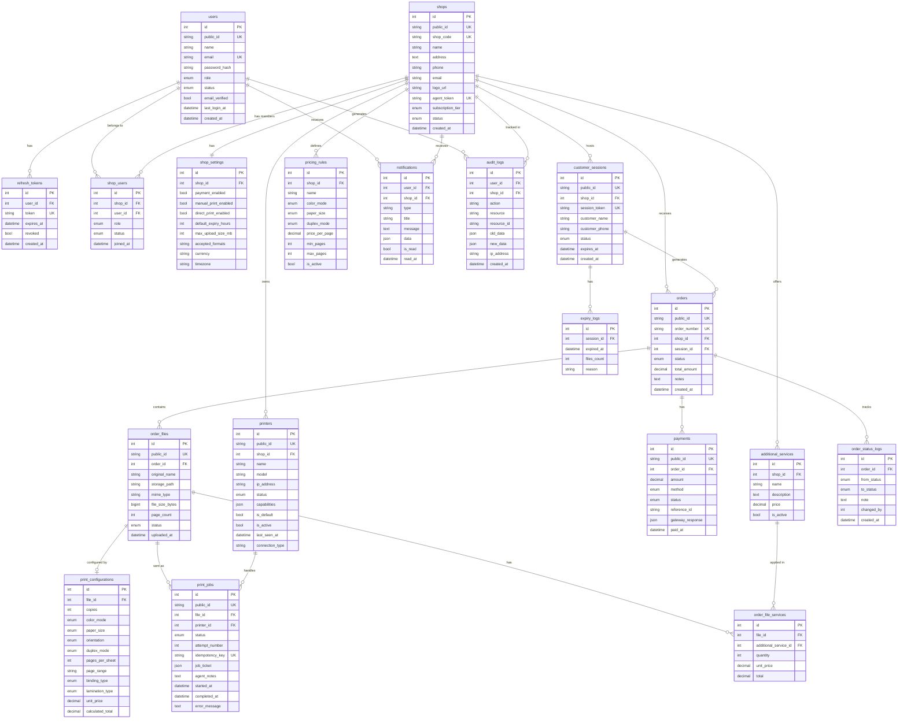

# SmartPrint – ER Diagram

```mermaid
erDiagram
    users {
        int id PK
        string public_id UK
        string name
        string email UK
        string password_hash
        enum role
        enum status
        bool email_verified
        datetime last_login_at
        datetime created_at
    }

    refresh_tokens {
        int id PK
        int user_id FK
        string token UK
        datetime expires_at
        bool revoked
        datetime created_at
    }

    shops {
        int id PK
        string public_id UK
        string shop_code UK
        string name
        text address
        string phone
        string email
        string logo_url
        string agent_token UK
        enum subscription_tier
        enum status
        datetime created_at
    }

    shop_users {
        int id PK
        int shop_id FK
        int user_id FK
        enum role
        enum status
        datetime joined_at
    }

    shop_settings {
        int id PK
        int shop_id FK
        bool payment_enabled
        bool manual_print_enabled
        bool direct_print_enabled
        int default_expiry_hours
        int max_upload_size_mb
        string accepted_formats
        string currency
        string timezone
    }

    customer_sessions {
        int id PK
        string public_id UK
        int shop_id FK
        string session_token UK
        string customer_name
        string customer_phone
        enum status
        datetime expires_at
        datetime created_at
    }

    orders {
        int id PK
        string public_id UK
        string order_number UK
        int shop_id FK
        int session_id FK
        enum status
        decimal total_amount
        text notes
        datetime created_at
    }

    order_files {
        int id PK
        string public_id UK
        int order_id FK
        string original_name
        string storage_path
        string mime_type
        bigint file_size_bytes
        int page_count
        enum status
        datetime uploaded_at
    }

    print_configurations {
        int id PK
        int file_id FK
        int copies
        enum color_mode
        enum paper_size
        enum orientation
        enum duplex_mode
        int pages_per_sheet
        string page_range
        enum binding_type
        enum lamination_type
        decimal unit_price
        decimal calculated_total
    }

    pricing_rules {
        int id PK
        int shop_id FK
        string name
        enum color_mode
        enum paper_size
        enum duplex_mode
        decimal price_per_page
        int min_pages
        int max_pages
        bool is_active
    }

    additional_services {
        int id PK
        int shop_id FK
        string name
        text description
        decimal price
        bool is_active
    }

    order_file_services {
        int id PK
        int file_id FK
        int additional_service_id FK
        int quantity
        decimal unit_price
        decimal total
    }

    payments {
        int id PK
        string public_id UK
        int order_id FK
        decimal amount
        enum method
        enum status
        string reference_id
        json gateway_response
        datetime paid_at
    }

    printers {
        int id PK
        string public_id UK
        int shop_id FK
        string name
        string model
        string ip_address
        enum status
        json capabilities
        bool is_default
        bool is_active
        datetime last_seen_at
        string connection_type
    }

    print_jobs {
        int id PK
        string public_id UK
        int file_id FK
        int printer_id FK
        enum status
        int attempt_number
        string idempotency_key UK
        json job_ticket
        text agent_notes
        datetime started_at
        datetime completed_at
        text error_message
    }

    order_status_logs {
        int id PK
        int order_id FK
        enum from_status
        enum to_status
        text note
        int changed_by
        datetime created_at
    }

    expiry_logs {
        int id PK
        int session_id FK
        datetime expired_at
        int files_count
        string reason
    }

    notifications {
        int id PK
        int user_id FK
        int shop_id FK
        string type
        string title
        text message
        json data
        bool is_read
        datetime read_at
    }

    audit_logs {
        int id PK
        int user_id FK
        int shop_id FK
        string action
        string resource
        string resource_id
        json old_data
        json new_data
        string ip_address
        datetime created_at
    }

    users           ||--o{ refresh_tokens     : "has"
    users           ||--o{ shop_users          : "belongs to"
    users           ||--o{ audit_logs          : "generates"
    users           ||--o{ notifications       : "receives"

    shops           ||--o{ shop_users          : "has members"
    shops           ||--|| shop_settings       : "has"
    shops           ||--o{ customer_sessions   : "hosts"
    shops           ||--o{ orders              : "receives"
    shops           ||--o{ pricing_rules       : "defines"
    shops           ||--o{ additional_services : "offers"
    shops           ||--o{ printers            : "owns"
    shops           ||--o{ notifications       : "receives"
    shops           ||--o{ audit_logs          : "tracked in"

    customer_sessions ||--o{ orders            : "generates"
    customer_sessions ||--o{ expiry_logs       : "has"

    orders          ||--o{ order_files         : "contains"
    orders          ||--o{ payments            : "has"
    orders          ||--o{ order_status_logs   : "tracks"

    order_files     ||--o| print_configurations : "configured by"
    order_files     ||--o{ print_jobs          : "sent as"
    order_files     ||--o{ order_file_services : "has"

    additional_services ||--o{ order_file_services : "applied in"

    printers        ||--o{ print_jobs          : "handles"
```
